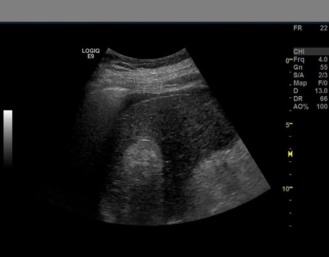
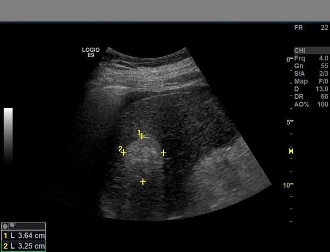

# Ablation Study On Faster RCNN For HCC Detection

                           |  
:-------------------------:|:-------------------------:
  |  

The codebase for my postgraduate thesis can be found in this repository. The common type of liver cancer, hepatoma, has been thoroughly studied using the Faster RCNN model.

This project's main objective is to evaluate the performance (speed and accuracy) of Faster RCNN model on the liver cancer detection with various backbones and parameters.

---

## Installation

[conda](https://docs.conda.io/en/latest/miniconda.html):
- `conda create --name faster-rcnn-proj -y`
- `conda activate faster-rcnn-proj`
- `conda install python=3.8 -y`
        
[venv](https://docs.python.org/3/library/venv.html):
- `python3 -m venv faster-rcnn-proj`
- `source faster-rcnn-proj/bin/activate`

Install the libraries:
   `pip install -r requirements.txt`

**Note**: CPU-version of torch will be installed. If you want to use a GPU or TPU, please refer to the instructions
on the [PyTorch website](https://pytorch.org/). To check whether pytorch uses the nvidia gpu, check
if `torch.cuda.is_available()` returns `True` in your python shell.
   

---

## Dependencies

These are the libraries that are used in this project:

- High-level deep learning library for PyTorch: [PyTorch Lightning](https://www.pytorchlightning.ai/)
- Visualization software: Custom code with the image-viewer [Napari](https://napari.org/)
- [OPTIONAL] Experiment tracking software/logging module: [Neptune](https://neptune.ai/)

If you want to use [Neptune](https://neptune.ai/) for your own experiments, add the `NEPTUNE` environment variable to
your system. Before you do that, create an account and an api key on `NEPTUNE`. Otherwise, deactivate it in the scripts. 

## Dataset

The dataset consists of 1200 hand labelled images from [The Cancer Imaging Archive](https://wiki.cancerimagingarchive.net/pages/viewpage.action?pageId=61080617#61080617bcab02c187174a288dbcbf95d26179e8). The labelling was done using [Napari](https://napari.org/) and details can be found in the annotation script. My labelled data can be found [here](https://drive.google.com/drive/folders/1d7WuqRQSmFah4tBh8Eo2eG-6v3nVvC8K?usp=sharing). The one on github is limited.

---

## Training
To train the model run the [training.ipynb](https://github.com/Ben74x/Ablation-Study-on-F-RCNN-for-HCC-Detection/blob/main/training.ipynb) notebook. It's crucial to consider anchor sizes and aspect ratios when training a Faster-RCNN model. Considering that these boxes are compared to those produced by the network, picking appropriate sizes and ratios can be crucial for a project's success. The AnchorGenerator's PyTorch implementation typically expects the following structure:
- anchor size: `Tuple[Tuple[int, ...], ...]`
- aspect ratio: `Tuple[Tuple[float, ...]]`

*Without the FPN*, the ResNet backbone always produces a single feature map that is utilised to build anchor boxes. As a result, we must construct a Tuple that only contains a single Tuple, such as `((32, 64, 128, 256, 512),)` or `(((32, 64),)`

*With FPN*, we can map our anchor sizes using 4 feature maps (results from a ResNet + FPN). This forces us to construct a Tuple that has exactly 4 Tuples, such as ((32,), (64,), (128,), (256), or ((8, 16, 32), (32, 64), (32, 64, 128, 256, 512), (200, 300)). The training was done on NVIDIA GeForce RTX 2080.

---

## Results
A lot of expirements were computed and these are the top results. 

| Backbone	| With FPN| mAP|
|:-:	|:-:	|:-:	|	
| **ResNet-101** 	| False|0.52|
| **ResNet-18** 	| True|0.486|
| **ResNet-34** 	| False|0.483|
| **ResNet-34** 	| True|0.475|
| **ResNet-152** 	| True|0.455|
| **ResNet-50** 	| True|0.446|
|**ResNet-101**|True|0.439|

---

## Weights
The weights can be found [here](https://drive.google.com/drive/folders/1Xkwz_MUL-f0oPA-h29OZ46XGB71MrIrG?usp=sharing)
